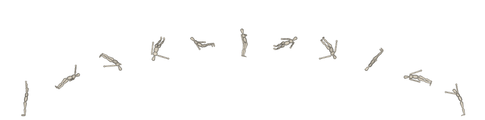

 
# Introduction
This repository contains the source code for an accepted article in Mechanism and Machine Theory.
It investigates the effect of
equations of motion and optimal control problems formulations (explicit and implicit)
to solve trampoline Miller optimal control problems with direct multiple shooting.

The repository is made available as accompanying material of [this publication](tobepublished):

```bibtex
@article{Puchaud2022,
  title={Optimality equivalence and computational advantages of free-floating base dynamics compared to full-body dynamics},
  author={Puchaud, Pierre and Charbonneau, Eve and Michaud, Benjamin and Begon, Mickael},
  journal={Mechanism and Machine Theory},
  volume={},
  number={},
  pages={},
  year={2022},
}
```
and includes scripts, models and materials to reproduce figures and results of that work.

## Data is available at

Puchaud, Pierre; Charbonneau, Eve; Michaud, Benjamin; Begon, Mickael (2022), “Simulation data of optimal control problems - Comparison of free-floating base and full-body dynamics for Trampoline Miller acrobatic”, Mendeley Data, V1, doi: 10.17632/rz8t786st8.1


## Status

| Type | Status |
|---|---|
| License | <a href="https://opensource.org/licenses/MIT"></a> |
| Zenodo  | [](https://zenodo.org/badge/latestdoi/440930554) |
| Data | [](https://data.mendeley.com/datasets/rz8t786st8)|


# Requirements
In order to run the code, you need to install the following packages from pyomeca:
```bash
conda install -c conda-forge biorbd=1.8.4
```
```bash
conda install -c conda-forge bioviz=2.1.7
```
```bash
conda install -c conda-forge bioptim=2.2.1
```

Extra dependencies are required to run the code.
- statsmodels: <a href="https://www.statsmodels.org/stable/index.html">statsmodels</a>
- plotly: <a href="https://plot.ly/python/">plotly</a>
- pandas: <a href="https://pandas.pydata.org/">pandas</a>

# Contents from the paper

Free-floating base dynamics equations are already used to quickly produce optimal trajectories in parametric optimization
for airborne motions in acrobatic movements. 
Implicit dynamics is also recommended in the literature to solve optimal control problems faster. 
However, these features have never been used to solve optimal control problems with a direct multiple shooting approach.
This study compared both full-body <i>vs</i> free-floating base dynamics and explicit <i>vs</i> implicit formulations of 
an optimal control problem generating a double straight somersault with three twists. Free-floating dynamics conducted to 
similar optimal costs for each formulation and systematically hastened the optimization. It was respectively 10 times and 2 times faster in explicit and implicit. 
Using implicit dynamics also hastened the optimization, but to achieve acceptable levels of dynamical consistency, 
additional variables were needed in the implicit formulation, being generalized jerks as controls and generalized accelerations as states.

## Implementation

The Enum Class MillerDynamics is used to define the Equation of Motion and the OCP formulation

- MillerDynamics.EXPLICIT: Explicit formulation of the OCP with full-body dynamics
- MillerDynamics.ROOT_EXPLICIT: Explicit formulation of the OCP with free-floating base dynamics
- MillerDynamics.IMPLICIT: Implicit formulation of the OCP with full-body dynamics
- MillerDynamics.ROOT_IMPLICIT: Implicit formulation of the OCP with free-floating base dynamics
- MillerDynamics.IMPLICIT_QDDDOT: Implicit formulation of the OCP with full-body dynamics and generalized accelerations as states and jerks as controls
- MillerDynamics.ROOT_IMPLICIT_QDDDOT: Implicit formulation of the OCP with free-floating base dynamics and generalized accelerations as states and jerks as controls

